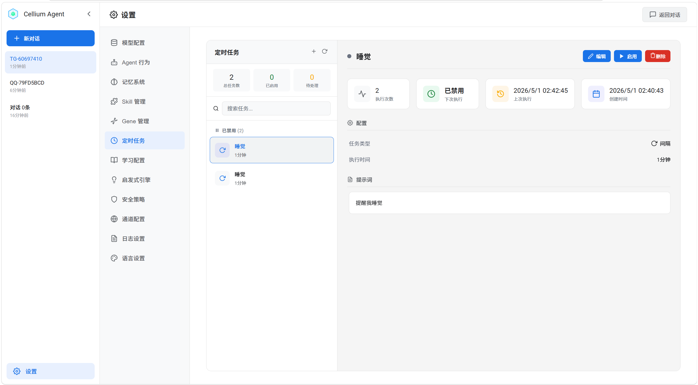

# Cellium Agent

<div align="center">


[](https://www.python.org/)
[](https://fastapi.tiangolo.com/)
[](LICENSE)
[](https://react.dev/)
[](https://www.typescriptlang.org/)
[]()

**这是一个自进化AI Agent**

[English](README_EN.md) | 中文

</div>

> **传统 Agent 重复犯错、陷入死循环、不会总结经验。所以我们选择让Agent无限进化**

基于微内核架构（EventBus + DI + BaseTool），支持任意 OpenAI 兼容 API


核心设计：决策环（Control Loop）驱动的自学习 Agent，通过贝叶斯 Bandit 实现自适应决策优化。

> 感谢 [Strategy Gene](https://arxiv.org/abs/2604.15097) 研究团队，本项目参考并使用了其提出的紧凑经验表示方法，让 Agent 从失败中自动进化，持续优化决策策略。

## 特性

| 特性 | 说明 |
|------|------|
| Agent 运行时自感知 | 实时感知运行状态（进度、停滞、循环、饱和度），动态调整决策 |
| 决策环架构 | 每轮决策 - 执行 - 反馈 - 学习的闭环控制 |
| 自学习系统 | 基于贝叶斯 Bandit 的 Action 选择，持续优化决策策略 |
| 三层记忆系统 | 人格记忆 + 会话记忆 + 长期记忆（FTS5全文检索 + 96维哈希向量混合召回） |
| 启发式决策引擎 | 规则提取特征 + Bandit 做 tie-break，兼顾可解释性与学习能力 |
| 工具使用控制 | 动态禁止/推荐工具切换，避免重复调用同一工具陷入循环 |
| 敏感信息控制 | 自动检测并脱敏私钥、Token、密码等敏感信息，支持写入拦截 |
| 组件热插拔 | app/components/ 下文件 3 秒自动加载生效 |
| 组件沙箱安全 | 三层防护：进程隔离 + 路径透明映射 + 危险方法拦截 |
| 事件驱动架构 | 基于 EventBus 的发布-订阅模式，组件松耦合 |
| Flash 模式 | 跳过记忆注入，加速简单任务 |
| 多通道接入 | 支持 QQ 等外部平台（目前只支持qqbot,telegram,持续更新中），通过 ChannelManager 统一管理消息路由、文件传输与注入 |
| 定时任务调度 | 支持间隔任务、每日任务、每周任务，通过自然语言创建任务，触发时自动调用 Agent 执行并推送结果到对应平台 |
| 后台组件事件触发 | 组件可在后台运行并主动触发 Agent 执行任务，支持实时场景（如虚拟币价格监控、实时数据推送、Agent 自动总结分析） |

## 快速开始

### 一键安装启动 (带环境)


**Windows:**
```cmd
curl -LO https://github.com/Cellium-Project/Cellium-Agent/releases/latest/download/Cellium-Agent-Windows.zip && powershell -Command "Expand-Archive -Path 'Cellium-Agent-Windows.zip' -DestinationPath '.'" && cd Cellium-Agent-Windows && CelliumAgent.exe
```

**Linux x64:**
```bash
curl -LO https://github.com/Cellium-Project/Cellium-Agent/releases/latest/download/Cellium-Agent-Linux.tar.gz && tar -xzf Cellium-Agent-Linux.tar.gz && cd Cellium-Agent-Linux && ./start-cellium.sh
```

**Linux ARM64:**
```bash
curl -LO https://github.com/Cellium-Project/Cellium-Agent/releases/latest/download/Cellium-Agent-Linux-ARM64.tar.gz && tar -xzf Cellium-Agent-Linux-ARM64.tar.gz && cd Cellium-Agent-Linux-ARM64 && ./start-cellium.sh
```

**macOS:**
```bash
curl -LO https://github.com/Cellium-Project/Cellium-Agent/releases/latest/download/Cellium-Agent-macOS.tar.gz && tar -xzf Cellium-Agent-macOS.tar.gz && cd Cellium-Agent-macOS && ./start-cellium.sh
```

> 更多安装选项见 [INSTALL.md](INSTALL.md)

### 从源码运行

```bash
pip install -r requirements.txt
python main.py
```

主要依赖：
- FastAPI + Uvicorn（Web 框架）
- PyYAML（配置解析）
- Jieba（中文分词）
- DrissionPage（用于网页搜索和操作浏览器）
- openai（OpenAI API 客户端）
- websockets（QQ Bot WebSocket 客户端）
- httpx（HTTP 客户端，用于外部平台文件上传）

### 配置模型

编辑 `config/agent/llm.yaml` 文件，配置 API 密钥、服务地址和模型名称。

### 启动服务

```bash
python main.py
```

启动后访问 http://localhost:18000 打开聊天界面，访问 http://localhost:18000/docs 查看 API 文档。
（默认端口 18000，如被占用会自动切换，请查看启动日志获取实际端口）

## 核心架构：决策环 + 自学习

Cellium Agent 的核心是 **Control Loop（控制环）** 驱动的决策系统，结合 **贝叶斯 Bandit** 实现自学习优化。

```
┌─────────────────────────────────────────────────────────────────────────┐
│                           自学习层 (Learning)                            │
│  ┌─────────────┐    ┌─────────────┐    ┌─────────────────────────────┐  │
│  │   Policy    │    │  Bayesian   │    │      PolicyBanditMemory     │  │
│  │  Templates  │───▶│   Bandit    │◄───│  (Thompson Sampling 统计)    │  │
│  │ (策略模板)   │    │ (策略选择)   │    │                             │  │
│  └─────────────┘    └──────┬──────┘    └─────────────────────────────┘  │
│                            │                                            │
└────────────────────────────┼────────────────────────────────────────────┘
                             │ 选择 Policy
                             ▼
┌─────────────────────────────────────────────────────────────────────────┐
│                          决策环层 (Control Loop)                         │
│                                                                         │
│   ┌──────────┐     ┌──────────────┐     ┌──────────────┐               │
│   │  Step    │────▶│   Feature    │────▶│    Rule      │               │
│   │ (每轮开始)│     │  Extraction  │     │  Evaluation  │               │
│   └──────────┘     │  (特征提取)   │     │  (规则评估)   │               │
│        │           └──────────────┘     └──────┬───────┘               │
│        │                                        │                       │
│        │           ┌────────────────────────────┘                       │
│        │           ▼                                                    │
│        │     ┌──────────────┐     ┌──────────────┐                     │
│        │     │   Action     │◄────│   Action     │                     │
│        │     │  Candidates  │     │   Bandit     │                     │
│        │     │  (候选动作)   │     │ (Tie-break)  │                     │
│        │     └──────┬───────┘     └──────────────┘                     │
│        │            │                                                  │
│        │            ▼                                                  │
│        │     ┌──────────────┐                                         │
│        │     │   Control    │                                         │
│        │     │   Decision   │                                         │
│        │     │   (决策输出)  │                                         │
│        │     └──────┬───────┘                                         │
│        │            │                                                  │
│        │     ┌──────┴───────┐     ┌──────────────┐                    │
│        └────▶│   Execute    │────▶│  End Round   │                    │
│              │   (执行)      │     │  (每轮结束)   │                    │
│              └──────────────┘     └──────┬───────┘                    │
│                                          │                             │
│                                          ▼                             │
│                              ┌──────────────────────┐                  │
│                              │  Feedback Evaluator  │                  │
│                              │    (反馈评估)         │                  │
│                              │   - 分段式评估        │                  │
│                              │   - n-step return    │                  │
│                              └──────────┬───────────┘                  │
│                                         │                              │
│                              ┌──────────┴───────────┐                  │
│                              ▼                      ▼                  │
│                    ┌─────────────────┐   ┌─────────────────┐          │
│                    │   Bandit Update │   │   Stats Persist │          │
│                    │   (更新统计)     │   │   (持久化)       │          │
│                    └─────────────────┘   └─────────────────┘          │
│                                                                         │
└─────────────────────────────────────────────────────────────────────────┘
```


### 决策环（Control Loop）工作流程

每轮循环包含 5 个阶段：

1. **特征提取（Feature Extraction）**
   - 启发式引擎提取当前状态特征
   - 包括：停滞迭代数、进展趋势、重复分数、上下文饱和度等

2. **规则评估（Rule Evaluation）**
   - 硬规则给出 action 候选集合
   - 例如：检测到循环时候选 [redirect, compress]

3. **Bandit Tie-break（Action 选择）**
   - 当候选 action 多于 1 个时，Bandit 介入
   - 使用 Thompson Sampling + Heuristic Bias 选择最优 action

4. **执行与反馈（Execute & Feedback）**
   - 执行选中的 action（continue/retry/redirect/compress/terminate）
   - FeedbackEvaluator 分段式评估本轮表现

5. **学习与更新（Learning & Update）**
   - 使用 n-step return 累积 reward
   - 更新 Bandit 的 Beta 分布参数
   - 定期衰减旧数据防止过拟合

### PEOP 循环（Plan-Execute-Observe-RePlan 循环）

PEOP 循环是决策环的扩展模块，实现**自适应计划-执行循环**。该模块根据任务复杂度动态调整策略：简单任务直接响应，复杂任务自动启用多步规划；执行过程中持续验证结果，发现偏差时局部重规划，通过显式状态管理实现高效、可靠的任务分解与执行：

```
┌─────────────────────────────────────────────────────────────┐
│                 计划执行引擎状态机                            │
│                                                             │
│  ┌─────────┐    ┌─────────┐    ┌─────────┐                 │
│  │ OBSERVE │───▶│  PLAN   │───▶│ EXECUTE │◄─────────────┐  │
│  │  观察   │    │  规划   │    │  执行   │   验证成功    │  │
│  └─────────┘    └─────────┘    └────┬────┘   继续下一步  │  │
│       ▲                             │                     │  │
│       │                      验证失败│                     │  │
│       │                             ▼                     │  │
│       │                        ┌─────────┐   重规划成功   │  │
│       │                        │ REPLAN  │───────────────┘  │
│       │                        │ 重规划  │                  │  │
│       │                        └────┬────┘                  │  │
│       │                             │                     │  │
│       └─────────────────────────────┘   重规划次数超限      │  │
│                                         或任务完成          │  │
│                                         ▼                  │  │
│                                       ┌─────┐              │  │
│                                       │DONE │              │  │
│                                       │完成 │              │  │
│                                       └─────┘              │  │
└─────────────────────────────────────────────────────────────┘
```

**核心机制**：

| 机制 | 说明 |
|------|------|
| **批量规划** | 一次生成多步执行计划（1-5步）支持并行执行工具调用（如果无依赖关系），减少 LLM 调用次数 |
| **状态驱动** | 5阶段显式状态机（OBSERVE/PLAN/EXECUTE/REPLAN/DONE） |
| **执行内验证** | 每步执行后自动验证结果 |
| **局部重规划** | 验证失败时保留成功步骤，仅重新规划失败及后续步骤 |

**工作流程**：

1. **观察（OBSERVE）**：分析用户输入，理解任务目标与上下文
2. **规划（PLAN）**：LLM 生成结构化计划，每步包含：工具名、参数、执行目的、预期结果
3. **执行（EXECUTE）**：按顺序执行计划步骤，每步执行后自动验证结果
   - 验证成功 → 继续执行下一步
   - 验证失败 → 进入 REPLAN 阶段
4. **重规划（REPLAN）**：保留已成功的步骤，仅对失败及后续步骤重新生成计划
5. **完成（DONE）**：所有步骤执行成功，或重规划次数超限

**设计特点**：
- **高效**：多步计划一次生成，执行阶段零 LLM 调用
- **稳定**：局部重规划避免全盘推翻，保持上下文连续性
- **可观测**：5阶段状态机提供清晰的执行轨迹，便于调试与监控
- **协同**：状态信息实时同步给 Control Loop，重规划触发 redirect 决策

**配置参数**：
- `max_plan_steps=5`：单次规划最多 5 个步骤
- `max_replans=3`：最多允许 3 次重规划

### Action 类型与策略

代码定义：`ACTION_TYPES = ["continue", "retry", "redirect", "compress", "terminate"]`

| Action | 说明 | Heuristic Bias 条件 |
|--------|------|---------------------|
| continue | 继续当前方向 | 进展分数 > 0.5 或停滞迭代为 0 |
| retry | 保持方向但修正策略 | 轻微停滞（1 <= stuck < threshold）或进展趋势在 0~0.3 |
| redirect | 换方向/换工具 | 重复分数 > 0.5 或停滞 >= stuck_threshold |
| compress | 压缩上下文 | 上下文饱和度 > 0.6 或停滞 >= stuck_threshold // 2 |
| terminate | 终止会话 | 硬规则触发：输出循环且 exact_repetition_count >= 5 |


### 自学习机制

**Policy - Bandit - Action 三层架构**：

```
┌─────────────────────────────────────────┐
│           Policy Templates              │
│  ┌─────────┬───────────┬─────────────┐  │
│  │ default │ efficient │ aggressive  │  │
│  │ 平衡策略 │  高效策略  │   激进策略   │  │
│  │(stuck=3)│ (stuck=2) │  (stuck=5)  │  │
│  └────┬────┴─────┬─────┴──────┬──────┘  │
│       │          │            │         │
│       ▼          ▼            ▼         │
│  ┌─────────────────────────────────┐    │
│  │      Bayesian Bandit            │    │
│  │  Thompson Sampling 选择最优 Policy │   │
│  │  - 从 Beta 分布采样              │    │
│  │  - 选择期望收益最高的 Policy      │    │
│  └─────────────┬───────────────────┘    │
│                │                        │
│                ▼                        │
│  ┌─────────────────────────────────┐    │
│  │        Action Bandit            │    │
│  │  在候选 action 内做 tie-break    │    │
│  │  - Heuristic 提供 bias          │    │
│  │  - 动态调整阈值参数              │    │
│  └─────────────────────────────────┘    │
└─────────────────────────────────────────┘
```

**学习过程**：

1. **Policy 选择**：会话开始时，Bayesian Bandit 从多个 Policy（default/efficient/aggressive）中选择当前最优策略
2. **阈值注入**：选中的 Policy 参数（如 stuck_iterations=3）注入 HeuristicEngine 和 ActionBandit
3. **Action 学习**：每轮结束后，根据 FeedbackEvaluator 的评分更新 Action 的 Beta 分布
4. **n-step return**：累积最近 n 轮的 reward，支持延迟反馈和序列优化
5. **数据衰减**：每 50 个会话衰减一次旧数据（衰减因子 0.99），防止过拟合

### 反馈评估（Feedback Evaluation）

采用**分段式设计**，先区分成功/失败，再优化细节：

- **成功分支**：基础分 1.0，扣除效率和成本
  - 迭代惩罚：迭代越少分越高
  - Token 惩罚：超出阈值扣分
  - 顺畅度奖励：无停滞加分

- **失败分支**：基础分 0.0，根据停滞程度扣分
  - 停滞迭代越多扣分越多
  - 错误类型影响扣分幅度

## 微内核架构

```
┌─────────────────────────────────────────────────────────────┐
│                        EventBus                              │
│              (发布-订阅，组件松耦合通信)                      │
├─────────────────────────────────────────────────────────────┤
│  ┌──────────┐  ┌──────────┐  ┌──────────┐  ┌───────────┐  │
│  │  LLM     │  │  Memory  │  │  Tools   │  │ Heuristics│  │
│  │  Engine  │  │  System  │  │          │  │  Engine   │  │
│  └──────────┘  └──────────┘  └──────────┘  └───────────┘  │
├─────────────────────────────────────────────────────────────┤
│                     AgentLoop（主循环）                      │
│  ┌────────────┐  ┌────────────┐  ┌────────────────────┐    │
│  │   Control   │  │   Tool    │  │   Prompt           │    │
│  │   Loop      │  │  Executor │  │   Context Builder  │    │
│  └────────────┘  └────────────┘  └────────────────────┘    │
└─────────────────────────────────────────────────────────────┘
```

### 核心组件

| 组件 | 说明 |
|------|------|
| AgentLoop | 事件驱动的核心主循环，协调 LLM、工具、记忆 |
| LLM Engine | 统一 LLM 接口，内置 40+ 模型注册表，自动检测上下文窗口、工具支持、最大输出 |
| ThreeLayerMemory | 三层记忆：人格 + 会话 + FTS5 长期检索 |
| HeuristicEngine | 启发式规则引擎，作为特征提取器为 Bandit 提供输入 |
| ControlLoop | 控制环核心，每轮决策 - 执行 - 反馈 - 学习 |
| ActionBandit | Action 选择器，Thompson Sampling + Heuristic Bias |
| LearningIntegration | 学习模块集成，Policy 选择和参数注入 |
| EventBus | 事件总线，组件间松耦合通信 |
| BaseTool | 工具基类，声明式命令注册模式 |

### 组件沙箱安全机制

Agent 编写的组件代码在独立的沙箱环境中运行，采用三层安全防护：

| 层级 | 机制 | 作用 |
|------|------|------|
| **进程隔离** | 组件在独立子进程运行 | 崩溃不影响主程序，通过 Queue 通信 |
| **路径透明映射** | 文件操作路径映射到 sandbox_root | 防路径穿越，保护真实系统文件 |
| **危险方法拦截** | 运行时拦截 os.system/subprocess 等 | 禁止执行系统命令 |

组件可以正常使用 `open()`、`os.listdir()` 等文件操作，但路径会被透明映射到项目目录下的 `sandbox_root/` 文件夹中。同时 `os.system()`、`subprocess.run()` 等危险方法会被拦截。

### Agent 运行时自状态感知

Agent 通过 FeatureExtractor 实时感知运行状态，动态调整决策策略：

| 状态维度 | 特征 | 说明 |
|----------|------|------|
| **进度状态** | progress_score | 任务完成进度估计 (0-1) |
| | stuck_iterations | 连续无进展迭代次数 |
| | is_making_progress | 是否在取得进展 |
| **趋势状态** | progress_trend | EMA 平滑后的进展趋势 (-1 到 1) |
| | convergence_rate | 收敛速度 |
| | is_plateau | 是否进入平台期 |
| **工具状态** | unique_tools_used | 使用过的不同工具数 |
| | tool_diversity_score | 工具多样性分数 |
| | repetition_score | 工具重复调用分数 |
| | pattern_detected | 检测到的循环模式 |
| **上下文状态** | context_saturation | 上下文饱和度 (0-1) |
| | context_saturation_level | 饱和等级: idle/normal/warn/redirect/stop |
| **结果质量** | error_rate | 工具调用错误率 |
| | empty_result_rate | 空结果率 |
| | result_quality_score | 结果质量综合分数 |
| **输出状态** | exact_repetition_count | LLM 输出完全重复次数 |
| | is_output_loop | 是否陷入输出循环 |

**自适应调整机制**：

1. **进展停滞检测**：stuck_iterations > threshold 时触发 redirect/retry
2. **上下文压力感知**：saturation > 0.7 时触发 compress，> 0.95 时触发 stop
3. **工具循环检测**：repetition_score > 0.5 时触发 redirect 换工具
4. **输出循环检测**：exact_repetition_count >= 5 时强制 terminate
5. **动态 HardConstraint**：根据状态实时生成控制指令（如 REDIRECT/COMPRESS/RETRY）


### 三层记忆

| 层级 | 实现 | 说明 |
|------|------|------|
| 人格记忆 | personality.md | 静态人格设定文件 |
| 会话记忆 | MemoryManager | 短期上下文，自动维护有界历史 |
| 长期记忆 | FTS5 + Repository | 向量检索 + 混合召回，支持知识提取和归档 |

**轻量级向量模型（96维）**：

长期记忆使用无需外部依赖的轻量级混合记忆检索系统，通过特征哈希向量与全文检索融合，实现本地高效的语义近似召回：

- **维度**：96 维
- **生成方式**：基于 SHA1 哈希的向量编码
  - 英文：字符 3-gram
  - 中文：词级 bigram + 完整拼音哈希 + 拼音 bigram
  - 分词（Jieba）+ 关键词提取
  - 每个 token 通过 SHA1 哈希映射到 96 维向量桶
  - 位置加权（前 8 个 token 额外 +0.25 权重）
- **相似度计算**：余弦相似度（cosine similarity）
- **混合召回**：FTS5 全文检索 + 向量相似度融合排序
- **中文增强**：拼音哈希实现中文谐音、拼音首字母匹配
- **依赖**：jieba（中文分词），可选 pypinyin（拼音增强）

**结构化 Schema 与分类系统**：

长期记忆采用分层分类设计，Schema 类型决定数据结构，Category 分类决定内容类型：

**Schema 类型（4种）**：

| Schema 类型 | 用途 | 包含的 Category |
|-------------|------|-----------------|
| `general` | 通用记忆、会话笔记 | `general`, `user_info`, `command`, `project` |
| `profile` | 用户画像 | `preference` |
| `project` | 项目相关 | `project` |
| `issue` | 问题排查 | `troubleshooting`, `code` |

**Category 分类（8种）**：

| Category | 说明 | 来源 |
|----------|------|------|
| `general` | 日常对话、知识问答 | 通用记忆 |
| `user_info` | 用户偏好、会话目标 | 会话笔记 (goal/goal_history) |
| `command` | 已执行的操作命令 | 会话笔记 (completed) |
| `project` | 项目配置、关键发现 | 通用记忆 / 会话笔记 (finding) |
| `preference` | 用户画像信息 | 通用记忆 |
| `troubleshooting` | 故障记录、解决方案 | 通用记忆 / 会话笔记 (error) |
| `code` | 代码相关记录 | 通用记忆 / 会话笔记 |

**会话压缩自动提取**：

会话压缩时自动提取以下类型的笔记，并映射到相应 Category 存入长期记忆：
- `goal` / `goal_history` → `user_info`
- `completed` → `command` / `code`
- `finding` → `project` / `code` / `command`
- `error` → `troubleshooting`
- `pending` → `general`

**敏感信息控制**：

记忆系统内置敏感信息检测与保护机制：

- **自动检测**：识别私钥、AWS 密钥、GitHub Token、API Key 等敏感内容
- **脱敏处理**：自动将敏感值替换为 `[REDACTED]`
- **写入拦截**：高风险敏感信息（如私钥）默认禁止写入记忆
- **分类标记**：敏感记忆会被标记，支持检索时过滤排除

### 启发式决策规则

| 规则 | 说明 |
|------|------|
| MaxIterationRule | 迭代次数上限终止 |
| TokenBudgetRule | Token 预算耗尽终止 |
| EmptyResultChainRule | 空结果链检测 |
| NoProgressRule | 无进展检测（EMA 平滑） |
| SameToolRepetitionRule | 同工具+参数重复调用检测 |
| PatternLoopRule | 模式循环检测 |
| ParameterSimilarityRule | 参数相似度检测 |

### 组件系统

| 功能 | 说明 |
|------|------|
| 自动发现 | 扫描 components/ 目录，自动发现继承 BaseCell 的组件类 |
| 热插拔 | ComponentWatcher 后台监控，3 秒间隔扫描，动态加载/卸载 |
| 工具包装 | ComponentToolRegistry 将 BaseCell 包装为 BaseTool，注入 AgentLoop |
| 信任白名单 | 组件需用户 /trust 确认，持久化到 trusted_components.json |
| 配置自动维护 | 发现新组件自动追加到 settings.yaml 的 enabled_components |

**保留工具名**（不可被组件覆盖）：
- `shell` — ShellTool
- `memory` — MemoryTool
- `file` — FileTool

### 原生组件自扩展

Cellium Agent 支持**运行时自扩展**能力，Agent 可在运行时动态创建并注入新组件，无需重启服务，实现Agent自我改装进化。

**核心原理**：

ComponentWatcher 后台进程每 3 秒扫描 `components/` 目录，发现新文件或文件变更后，自动触发加载流程：扫描发现 → 实例化组件类 → 审计合规性 → 写入配置文件 → 注册到工具注册表 → AgentLoop 动态读取。整个过程全自动，新工具立即可用。

**组件规范**：

组件必须继承 BaseCell，定义唯一的 cell_name 标识，命令方法以 `_cmd_` 前缀命名并附带 docstring 描述。文件放入 `components/` 目录即自动生效。

**组件生成器**：

系统内置 ComponentBuilder 组件，Agent 可通过 `component.generate` 命令快速创建符合规范的组件，自动生成完整的类结构、命令方法和帮助文档。

**管理 API**：

系统提供完整的组件管理接口，支持扫描发现、热重载、手动加载、卸载等操作，Agent 可通过 API 自主管理自身能力。

**目录约定**：
```
components/
├── __init__.py              # 包标记
├── _example_component.py    # 组件模板参考
├── component_builder.py     # 组件生成器（系统内置）
├── skill_installer.py       # Skill 安装器（支持从压缩包安装）
├── skill_manager.py         # Skill 管理器（列表、搜索、详情、卸载）
└── my_tool.py               # Agent 创建的组件（系统级）
```

### QQBot 文件传输组件 (qq_files)

支持在 QQBot 和本地之间传输文件：

| 命令 | 功能 | 示例 |
|------|------|------|
| `download` | 从 QQ 下载文件 | `{"url": "...", "filename": "doc.pdf"}` |
| `send_file` | 发送文件到 QQ | `{"target_id": "...", "file_path": "...", "is_group": false}` |
| `send_image` | 发送图片到 QQ | `{"target_id": "...", "image_path": "..."}` |
| `list_downloads` | 列出下载的文件 | `{}` |

**文件保存路径**：`workspace/downloads/qq/`

### 原生览器操作组件 (web_fetch)

基于 DrissionPage 的无头浏览器组件，支持网页自动化操作：

| 命令 | 功能 | 示例 |
|------|------|------|
| `navigate` | 访问指定 URL | `{"url": "https://example.com"}` |
| `get_screenshot` | 截图（支持元素级截图） | `{"full_page": false, "selector": "#content"}` |
| `find_qrcode` | 查找页面二维码 | `{}` |
| `js_action` | 页面操作（click/input/scroll_to） | `{"selector": "button", "action": "click"}` |
| `find_button` | 查找按钮元素 | `{"value": "登录"}` |
| `get_page_info` | 获取页面信息 | `{}` |
| `scroll` | 滚动页面 | `{"direction": "down", "amount": 500}` |
| `save_cookies` / `load_cookies` | Cookie 持久化 | `{"path": "cookies.json"}` |

**使用场景**：
- 网页内容抓取与分析
- 自动化登录流程（支持二维码识别）
- 网页截图与视觉验证
- 表单自动填写与提交

**截图保存路径**：`workspace/web_fetch_screenshots/域名_时间戳.png`

**核心机制**：
- `_cell_registry`: cell_name → ICell 实例
- `get_all_tools()`: AgentLoop 运行时动态读取组件工具
- `get_tool_definitions()`: 返回 LLM 格式的工具定义

**工具操作可见性**：
- 所有工具调用都会生成用户友好的操作描述
- 支持 `_intent` 参数自定义描述（最高优先级）
- 示例：`{"command": "read", "path": "test.py", "_intent": "正在读取配置文件"}`

### Skill 管理系统 (skill_installer + skill_manager)

完整的 Skill 包管理解决方案，支持从压缩包安装、列表展示、搜索、详情查看和卸载。

**安装方式**：
- 支持 `.zip`、`.tar.gz`、`.tgz`、`.tar` 格式压缩包
- 压缩包内需包含 `SKILL.md` 文件
- 自动解析 `SKILL.md` 的 YAML Frontmatter 元信息

**管理功能**：

| 组件 | 功能 | 命令/接口 |
|------|------|-----------|
| `skill_installer` | 安装 Skill | `install_from_archive(path)` |
| `skill_installer` | 刷新索引 | `refresh_index()` |
| `skill_manager` | 列出所有 Skill | `list(show_details=True)` |
| `skill_manager` | 搜索 Skill | `search(query)` |
| `skill_manager` | 获取详情 | `get_info(name)` |
| `skill_manager` | 卸载 Skill | `uninstall(name)` |

**前端界面**：

- 设置页面提供 Skill 管理面板
- 支持压缩包上传安装
- 支持按名称、描述、分类过滤
- 详情弹窗展示完整元信息

**目录约定**：
```
components/
├── skill_installer.py        # Skill 安装器
├── skill_manager.py          # Skill 管理器
└── skills/                   # Skill 安装目录
    ├── skill-a/              # 已安装的 Skill
    │   └── SKILL.md
    ├── skill-b/
    │   └── SKILL.md
    └── _index.json           # 索引文件（自动生成）
    
```

### 定时任务调度 (scheduler)



支持三种任务类型：

| 类型 | 说明 | 示例 |
|------|------|------|
| 间隔任务 | 每隔固定时间执行一次 | 每30分钟提醒喝水 |
| 每日任务 | 每天固定时间执行 | 每天9点发送日报 |
| 每周任务 | 每周固定时间执行 | 每周一10点发送周报 |

**使用方式**：通过自然语言创建定时任务，任务触发时 Agent 会自动执行任务内容。支持复杂任务场景：
- "每隔1小时检查服务器状态并汇报结果"
- "每天早上8点查询今日天气"
- "每周五下午5点总结本周工作进度"

任务执行结果会自动推送到创建任务的平台（WebUI/QQ/Telegram）。

### 后台组件事件触发

组件可以在后台运行并主动触发 Agent 执行任务，实现实时数据推送和自动分析。

**实时场景示例**：
- 虚拟币价格监控：检测到价格突破阈值时推送数据，Agent 自动分析趋势
- 服务器状态监控：CPU/内存异常时推送告警，Agent 生成诊断报告
- 实时新闻订阅：检测到关键词新闻时推送，Agent 自动总结要点
- 数据库变更监听：关键数据变化时推送，Agent 执行相应处理逻辑

事件触发结果会自动推送到对应的 session（WebUI/QQ/Telegram）。


## 目录结构

```
Cellium-Agent/
├── app/                        # 应用核心代码
│   ├── agent/                  # Agent 核心模块
│   │   ├── control/            # 控制环：ControlLoop、ActionBandit、FeedbackEvaluator
│   │   ├── events/             # 事件模型与类型定义
│   │   ├── heuristics/         # 启发式引擎：规则、特征提取、评分
│   │   │   └── rules/          # 启发式规则：终止规则、循环检测
│   │   ├── learning/           # 学习模块：BayesianBandit、Policy
│   │   ├── llm/                # LLM 引擎，支持 OpenAI 兼容 API
│   │   ├── loop/               # Agent 主循环：AgentLoop、SessionManager、ToolExecutor
│   │   ├── memory/             # 三层记忆：FTS5、Repository、ArchiveStore
│   │   ├── tools/              # 工具基类与内置工具
│   │   ├── prompt/             # Prompt 构建器
│   │   ├── shell/              # Shell 交互
│   │   ├── security/           # 安全策略
│   │   └── di_config.py        # 依赖注入配置
│   ├── channels/               # 通道适配层
│   │   ├── base.py             # 通道基类 IChannelAdapter，支持文件消息抽象接口
│   │   ├── channel_manager.py  # 通道管理器，消息路由、文件传输与注入
│   │   ├── qq_adapter.py       # QQBot 适配器（消息 + 文件传输）
│   │   ├── qq_channel_config.py # QQ 通道配置模型
│   │   ├── telegram_adapter.py # Telegram Bot 适配器（消息 + 文件传输）
│   │   └── telegram_channel_config.py # Telegram 通道配置模型
│   ├── core/                   # 核心基础设施
│   │   ├── bus/                # 事件总线 EventBus
│   │   ├── di/                 # 依赖注入容器
│   │   ├── interface/          # 核心接口定义
│   │   ├── security/           # 安全模块
│   │   └── util/               # 工具类：ComponentWatcher、Logger 等
│   └── server/                 # FastAPI 服务层
│       └── routes/             # API 路由：chat、memory、channels、session_events
├── components/                 # 组件目录（热插拔）
│   ├── _example_component.py   # 组件模板参考
│   ├── component_builder.py    # 组件生成器（系统内置）
│   ├── qq_files.py             # QQ 文件传输组件
│   ├── telegram_files.py       # Telegram 文件传输组件
│   ├── web_fetch.py            # 网页获取组件
│   ├── web_search.py           # 网页搜索组件
│   ├── skill_installer.py      # Skill 安装器（支持 .zip/.tar.gz 压缩包安装）
│   ├── skill_manager.py        # Skill 管理器（列表、搜索、详情、卸载）
│   └── skills/                 # Skill 安装目录
├── config/agent/               # 配置文件
│   ├── channels.yaml           # 通道配置（QQ、Telegram 等外部平台）
│   └── llm.yaml                # LLM 模型配置
├── ui/                         # React 前端源码
├── html/                       # 前端构建输出
├── memory/                     # 记忆存储目录
├── tests/                      # 单元测试
└── main.py                     # 入口文件
```

## Strategy Gene (GEP) 集成

Cellium Agent --- **2026-04-22** 引入 [Strategy Gene](https://arxiv.org/abs/2604.15097) 论文设计理念。

### 实现方式

论文提出将经验编码为紧凑的 Gene 对象（~230 tokens），替代文档型 Skill 包（~2,500 tokens）。本项目在 Control Loop 的 Hard Constraint 层实现：

- **任务匹配**：用户输入关键词匹配 Gene 模板
- **动态注入**：匹配到的 Gene 作为系统提示注入 LLM
- **经验进化**：失败时自动提取 Avoid_Cues 并更新 Gene

### 实现的功能

| 论文概念 | 本项目实现 |
|----------|-----------|
| Gene 结构 | `[HARD CONSTRAINTS]` + `[CONTROL ACTION]` + `[AVOID]` |
| 任务匹配 | `TaskSignalMatcher` 关键词匹配 |
| Avoid_Cues | 从失败反馈自动提取，写入 `[AVOID]` 段 |
| 版本管理 | `version` 字段 + `evolution_history` 记录变更 |
| 效果评估 | `success_rate`, `avg_reward`, `consecutive_success/failure` |
| 交叉组合 | `GeneComposer` 多任务时合并多个 Gene |

## License

Apache 2.0
