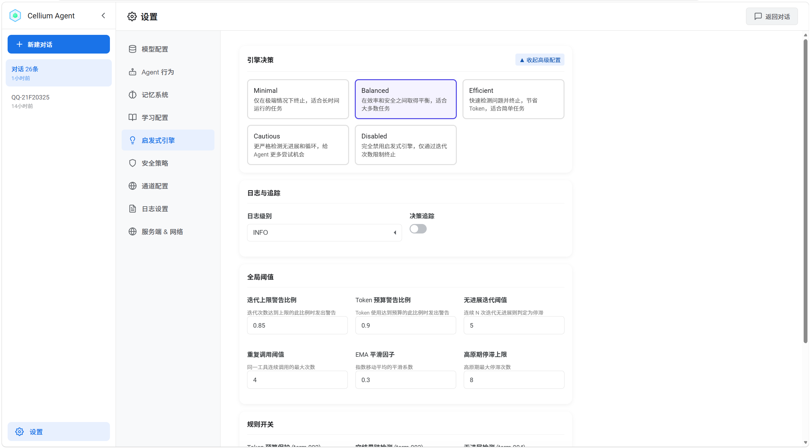
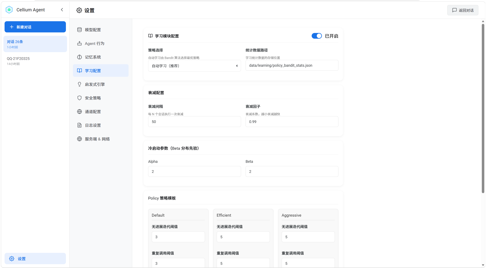
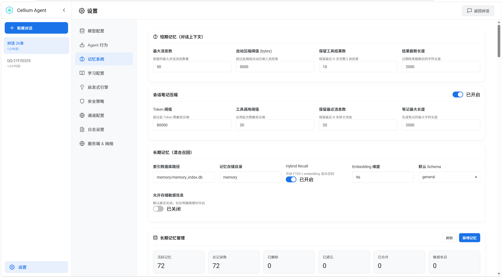
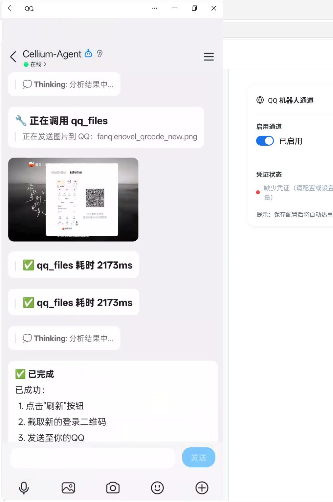
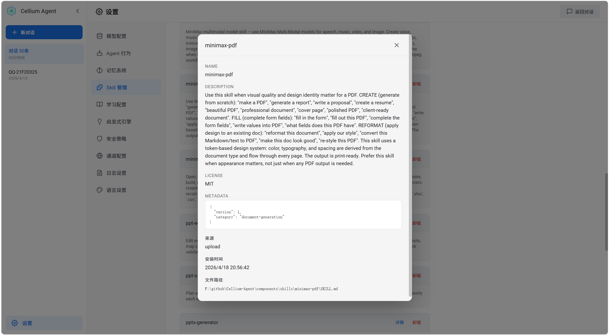

# Cellium Agent

<div align="center">


[](https://www.python.org/)
[](https://fastapi.tiangolo.com/)
[](LICENSE)
[](https://react.dev/)
[](https://www.typescriptlang.org/)
[]()

**A Self-Evolving AI Agent**

English | [中文](README.md)

</div>

> **Traditional Agents repeat mistakes, get stuck in loops, and never learn from experience. That's why we chose to make Agents evolve infinitely.**

Based on microkernel architecture (EventBus + DI + BaseTool), supporting any OpenAI-compatible API.

Core design: Self-learning Agent driven by Control Loop, with adaptive decision optimization through Bayesian Bandit.

> Thanks to the [Strategy Gene](https://arxiv.org/abs/2604.15097) research team. This project adopts their compact experience representation method, enabling the Agent to automatically learn avoidance strategies from failures.

## Features

| Feature | Description |
|---------|-------------|
| Runtime Self-Awareness | Real-time perception of running state (progress, stagnation, loops, saturation), dynamically adjusting decisions |
| Control Loop Architecture | Closed-loop control of decision - execution - feedback - learning in each iteration |
| Self-Learning System | Action selection based on Bayesian Bandit, continuously optimizing decision strategies |
| Three-Layer Memory | Personality memory + Session memory + Long-term memory (FTS5 full-text retrieval + 96-dim hash vector hybrid recall) |
| Heuristic Decision Engine | Rule-based feature extraction + Bandit for tie-breaking, balancing interpretability and learning ability |
| Tool Usage Control | Dynamic prohibition/recommendation of tool switching, avoiding loops from repeated tool calls |
| Sensitive Info Control | Auto-detect and redact sensitive info like private keys, tokens, passwords; supports write blocking |
| Component Hot-Plug | Files in app/components/ automatically load and take effect within 3 seconds |
| Component Sandbox Security | Three-layer protection: Process isolation + transparent path mapping + dangerous method interception |
| Event-Driven Architecture | Publish-subscribe pattern based on EventBus, loose coupling between components |
| Flash Mode | Skip memory injection to accelerate simple tasks |
| Multi-Channel Access | Support external platforms like QQ (currently supports QQ Bot, Telegram, more coming), unified message routing, file transfer and injection through ChannelManager |
| Scheduled Tasks | Support interval tasks, daily tasks, weekly tasks. Create tasks via natural language, Agent executes and pushes results to the corresponding platform when triggered |
| Background Component Events | Components can run in background and actively trigger Agent execution, supporting real-time scenarios (e.g., crypto price monitoring, real-time data push, Agent auto-analysis) |

## Quick Start

### One-Line Install (with Environment)

### Windows

```powershell
powershell -Command "Invoke-WebRequest -Uri 'https://github.com/Cellium-Project/Cellium-Agent/releases/latest/download/Cellium-Agent-Windows.zip' -OutFile 'Cellium-Agent-Windows.zip'; Expand-Archive -Path 'Cellium-Agent-Windows.zip' -DestinationPath '.' -Force; cd Cellium-Agent-Windows; .\CelliumAgent.exe"
```

**Linux x64:**
```bash
curl -LO https://github.com/Cellium-Project/Cellium-Agent/releases/latest/download/Cellium-Agent-Linux.tar.gz && tar -xzf Cellium-Agent-Linux.tar.gz && cd Cellium-Agent-Linux && ./start-cellium.sh
```

**Linux ARM64:**
```bash
curl -LO https://github.com/Cellium-Project/Cellium-Agent/releases/latest/download/Cellium-Agent-Linux-ARM64.tar.gz && tar -xzf Cellium-Agent-Linux-ARM64.tar.gz && cd Cellium-Agent-Linux-ARM64 && ./start-cellium.sh
```

**macOS:**
```bash
curl -LO https://github.com/Cellium-Project/Cellium-Agent/releases/latest/download/Cellium-Agent-macOS.tar.gz && tar -xzf Cellium-Agent-macOS.tar.gz && cd Cellium-Agent-macOS && ./start-cellium.sh
```

> See [INSTALL.md](INSTALL.md) for more installation options

### Run from Source

```bash
pip install -r requirements.txt
python main.py
```

Main dependencies:
- FastAPI + Uvicorn (Web framework)
- PyYAML (Configuration parsing)
- Jieba (Chinese word segmentation)
- DrissionPage (Web search and browser automation)
- openai (OpenAI API client)
- websockets (QQ Bot WebSocket client)
- httpx (HTTP client for external platform file upload)

### Configure Models

Edit the `config/agent/llm.yaml` file to configure API keys, service addresses, and model names.

### Start Service

```bash
python main.py
```

After startup, visit http://localhost:18000 to open the chat interface, and http://localhost:18000/docs to view API documentation.
(Default port 18000, will automatically switch if occupied, check startup logs for actual port)

## Core Architecture: Control Loop + Self-Learning

The core of Cellium Agent is a **Control Loop** driven decision-making system, combined with **Bayesian Bandit** for self-learning optimization.

```
┌─────────────────────────────────────────────────────────────────────────┐
│                           Learning Layer                                │
│  ┌─────────────┐    ┌─────────────┐    ┌─────────────────────────────┐  │
│  │   Policy    │    │  Bayesian   │    │      PolicyBanditMemory     │  │
│  │  Templates  │───▶│   Bandit    │◄───│  (Thompson Sampling Stats)  │  │
│  │             │    │             │    │                             │  │
│  └─────────────┘    └──────┬──────┘    └─────────────────────────────┘  │
│                            │                                            │
└────────────────────────────┼────────────────────────────────────────────┘
                             │ Select Policy
                             ▼
┌─────────────────────────────────────────────────────────────────────────┐
│                          Control Loop Layer                             │
│                                                                         │
│   ┌──────────┐     ┌──────────────┐     ┌──────────────┐               │
│   │   Step   │────▶│   Feature    │────▶│    Rule      │               │
│   │ (Start)  │     │  Extraction  │     │  Evaluation  │               │
│   └──────────┘     │              │     │              │               │
│        │           └──────────────┘     └──────┬───────┘               │
│        │                                        │                       │
│        │           ┌────────────────────────────┘                       │
│        │           ▼                                                    │
│        │     ┌──────────────┐     ┌──────────────┐                     │
│        │     │   Action     │◄────│   Action     │                     │
│        │     │  Candidates  │     │   Bandit     │                     │
│        │     │              │     │ (Tie-break)  │                     │
│        │     └──────┬───────┘     └──────────────┘                     │
│        │            │                                                  │
│        │            ▼                                                  │
│        │     ┌──────────────┐                                         │
│        │     │   Control    │                                         │
│        │     │   Decision   │                                         │
│        │     │   (Output)   │                                         │
│        │     └──────┬───────┘                                         │
│        │            │                                                  │
│        │     ┌──────┴───────┐     ┌──────────────┐                    │
│        └────▶│   Execute    │────▶│  End Round   │                    │
│              │              │     │              │                    │
│              └──────────────┘     └──────┬───────┘                    │
│                                          │                             │
│                                          ▼                             │
│                              ┌──────────────────────┐                  │
│                              │  Feedback Evaluator  │                  │
│                              │  (Feedback Eval)     │                  │
│                              │   - Segmented Eval   │                  │
│                              │   - n-step return    │                  │
│                              └──────────┬───────────┘                  │
│                                         │                              │
│                              ┌──────────┴───────────┐                  │
│                              ▼                      ▼                  │
│                    ┌─────────────────┐   ┌─────────────────┐          │
│                    │   Bandit Update │   │   Stats Persist │          │
│                    │   (Update Stats)│   │   (Persistence) │          │
│                    └─────────────────┘   └─────────────────┘          │
│                                                                         │
└─────────────────────────────────────────────────────────────────────────┘
```

### Control Loop Workflow

Each loop contains 5 stages:

1. **Feature Extraction**
   - Heuristic engine extracts current state features
   - Includes: stagnation iterations, progress trends, repetition scores, context saturation, etc.

2. **Rule Evaluation**
   - Hard rules provide action candidate sets
   - Example: detect loops and candidate [redirect, compress]

3. **Bandit Tie-break (Action Selection)**
   - When candidate actions > 1, Bandit intervenes
   - Uses Thompson Sampling + Heuristic Bias to select optimal action

4. **Execute & Feedback**
   - Execute selected action (continue/retry/redirect/compress/terminate)
   - FeedbackEvaluator performs segmented evaluation of this round's performance

5. **Learning & Update**
   - Use n-step return to accumulate rewards
   - Update Bandit's Beta distribution parameters
   - Regularly decay old data to prevent overfitting

### PEOP Loop (Plan-Execute-Observe-RePlan Loop)

The PEOP Loop is an extension module of the Control Loop, implementing an **adaptive plan-execute cycle**. This module dynamically adjusts strategy based on task complexity: simple tasks receive direct responses, complex tasks automatically enable multi-step planning; during execution, results are continuously validated, and local replanning is triggered when deviations are detected, achieving efficient and reliable task decomposition through explicit state management:

```
┌─────────────────────────────────────────────────────────────┐
│              Plan-Execute Engine State Machine               │
│                                                              │
│  ┌─────────┐    ┌─────────┐    ┌─────────┐                  │
│  │ OBSERVE │───▶│  PLAN   │───▶│ EXECUTE │◄──────────────┐  │
│  │ Observe │    │  Plan   │    │ Execute │  Validation    │  │
│  └─────────┘    └─────────┘    └────┬────┘  Success → Next │  │
│       ▲                             │                      │  │
│       │                   Validation│                      │  │
│       │                      Failed │                      │  │
│       │                             ▼                      │  │
│       │                        ┌─────────┐  Replan Success │  │
│       │                        │ REPLAN  │─────────────────┘  │
│       │                        │ Replan  │                   │  │
│       │                        └────┬────┘                   │  │
│       │                             │                      │  │
│       └─────────────────────────────┘  Max Replan Reached   │  │
│                                        or Task Complete     │  │
│                                        ▼                    │  │
│                                      ┌─────┐                │  │
│                                      │DONE │                │  │
│                                      │Done │                │  │
│                                      └─────┘                │  │
└─────────────────────────────────────────────────────────────┘
```

**Core Mechanisms**:

| Mechanism | Description |
|-----------|-------------|
| **Batch Planning** | Generate multi-step execution plan at once (1-5 steps), reducing LLM call frequency |
| **State-Driven** | 5-phase explicit state machine (OBSERVE/PLAN/EXECUTE/REPLAN/DONE) |
| **In-Execution Validation** | Automatic result validation after each step (semantic matching + Jaccard similarity + purpose-driven) |
| **Local Replanning** | Preserve successful steps on validation failure, only replan failed and subsequent steps |

**Workflow**:

1. **OBSERVE**: Analyze user input, understand task goals and context
2. **PLAN**: LLM generates structured plan, each step contains: tool name, parameters, execution purpose, expected result
3. **EXECUTE**: Execute plan steps sequentially, automatic validation after each step
   - Validation Success → Continue to next step
   - Validation Failed → Enter REPLAN phase
4. **REPLAN**: Preserve successful steps, only regenerate plan for failed and subsequent steps
5. **DONE**: All steps executed successfully, or max replanning reached

**Design Characteristics**:
- **Efficient**: Multi-step plan generated once, zero LLM calls during execution phase
- **Reliable**: Expectation validation uses semantic matching, avoiding misjudgment (e.g., "function X" and "get_X" considered matching)
- **Stable**: Local replanning avoids total overhaul, maintaining context continuity
- **Observable**: 5-phase state machine provides clear execution trace for debugging and monitoring
- **Collaborative**: State information synchronized to Control Loop in real-time, replanning triggers redirect decision

**Configuration**:
- `max_plan_steps=5`: Maximum 5 steps per plan
- `max_replans=3`: Maximum 3 replanning attempts

### Action Types & Strategies

Code definition: `ACTION_TYPES = ["continue", "retry", "redirect", "compress", "terminate"]`

| Action | Description | Heuristic Bias Condition |
|--------|-------------|--------------------------|
| continue | Continue current direction | Progress score > 0.5 or stagnation iterations = 0 |
| retry | Maintain direction but correct strategy | Mild stagnation (1 <= stuck < threshold) or progress trend 0~0.3 |
| redirect | Change direction/tool | Repetition score > 0.5 or stagnation >= stuck_threshold |
| compress | Compress context | Context saturation > 0.6 or stagnation >= stuck_threshold // 2 |
| terminate | Terminate session | Hard rule triggered: output loop and exact_repetition_count >= 5 |

### Self-Learning Mechanism

**Policy - Bandit - Action Three-Layer Architecture**:

```
┌─────────────────────────────────────────┐
│           Policy Templates              │
│  ┌─────────┬───────────┬─────────────┐  │
│  │ default │ efficient │ aggressive  │  │
│  │(stuck=3)│ (stuck=2) │  (stuck=5)  │  │
│  └────┬────┴─────┬─────┴──────┬──────┘  │
│       │          │            │         │
│       ▼          ▼            ▼         │
│  ┌─────────────────────────────────┐    │
│  │      Bayesian Bandit            │    │
│  │  Thompson Sampling selects      │    │
│  │  optimal Policy                 │    │
│  │  - Sample from Beta dist        │    │
│  │  - Select highest expected      │    │
│  │    return Policy                │    │
│  └─────────────┬───────────────────┘    │
│                │                        │
│                ▼                        │
│  ┌─────────────────────────────────┐    │
│  │        Action Bandit            │    │
│  │  Tie-break within candidates    │    │
│  │  - Heuristic provides bias      │    │
│  │  - Dynamic threshold adjustment │    │
│  └─────────────────────────────────┘    │
└─────────────────────────────────────────┘
```

**Learning Process**:

1. **Policy Selection**: At session start, Bayesian Bandit selects current optimal policy from multiple Policies (default/efficient/aggressive)
2. **Threshold Injection**: Selected Policy parameters (e.g., stuck_iterations=3) inject into HeuristicEngine and ActionBandit
3. **Action Learning**: After each round, update Action's Beta distribution based on FeedbackEvaluator's score
4. **n-step return**: Accumulate rewards from recent n rounds, supporting delayed feedback and sequence optimization
5. **Data Decay**: Decay old data every 50 sessions (decay factor 0.99) to prevent overfitting

### Feedback Evaluation

Uses **segmented design**, first distinguishing success/failure, then optimizing details:

- **Success Branch**: Base score 1.0, deduct efficiency and cost
  - Iteration penalty: fewer iterations = higher score
  - Token penalty: deduct points if exceeding threshold
  - Smoothness reward: bonus for no stagnation

- **Failure Branch**: Base score 0.0, deduct points based on stagnation degree
  - More stagnation iterations = more points deducted
  - Error type affects deduction magnitude

## Microkernel Architecture

```
┌─────────────────────────────────────────────────────────────┐
│                        EventBus                              │
│              (Publish-Subscribe, Loose Coupling)            │
├─────────────────────────────────────────────────────────────┤
│  ┌──────────┐  ┌──────────┐  ┌──────────┐  ┌───────────┐  │
│  │  LLM     │  │  Memory  │  │  Tools   │  │ Heuristics│  │
│  │  Engine  │  │  System  │  │          │  │  Engine   │  │
│  └──────────┘  └──────────┘  └──────────┘  └───────────┘  │
├─────────────────────────────────────────────────────────────┤
│                     AgentLoop (Main Loop)                  │
│  ┌────────────┐  ┌────────────┐  ┌────────────────────┐    │
│  │   Control  │  │   Tool     │  │   Prompt           │    │
│  │   Loop     │  │  Executor  │  │   Context Builder  │    │
│  └────────────┘  └────────────┘  └────────────────────┘    │
└─────────────────────────────────────────────────────────────┘
```

### Core Components

| Component | Description |
|-----------|-------------|
| AgentLoop | Event-driven core main loop, coordinating LLM, tools, memory |
| LLM Engine | Unified LLM interface, built-in 40+ model registry, auto-detecting context window, tool support, max output |
| ThreeLayerMemory | Three-layer memory: Personality + Session + FTS5 long-term retrieval |
| HeuristicEngine | Heuristic rule engine, serves as feature extractor for Bandit |
| ControlLoop | Control loop core, decision - execution - feedback - learning each round |
| ActionBandit | Action selector, Thompson Sampling + Heuristic Bias |
| LearningIntegration | Learning module integration, Policy selection and parameter injection |
| EventBus | Event bus, loose coupling communication between components |
| BaseTool | Tool base class, declarative command registration pattern |

### Component Sandbox Security

Agent-written component code runs in an isolated sandbox environment with three-layer security protection:

| Layer | Mechanism | Function |
|-------|-----------|----------|
| **Process Isolation** | Components run in separate subprocess | Crash won't affect main process, communicate via Queue |
| **Transparent Path Mapping** | File operation paths mapped to sandbox_root | Prevent path traversal, protect real system files |
| **Dangerous Method Interception** | Runtime interception of os.system/subprocess | Block system command execution |

Component code can use `open()`, `os.listdir()` normally, but paths are transparently mapped to the `sandbox_root/` folder in the project directory. Meanwhile, dangerous methods like `os.system()`, `subprocess.run()` are intercepted at runtime.

### Agent Runtime Self-State Awareness

Agent perceives running state in real-time through FeatureExtractor, dynamically adjusting decision strategies:

| State Dimension | Feature | Description |
|-----------------|---------|-------------|
| **Progress** | progress_score | Task completion progress estimate (0-1) |
| | stuck_iterations | Consecutive non-progress iterations |
| | is_making_progress | Whether progress is being made |
| **Trend** | progress_trend | EMA-smoothed progress trend (-1 to 1) |
| | convergence_rate | Convergence speed |
| | is_plateau | Whether in plateau phase |
| **Tool** | unique_tools_used | Number of different tools used |
| | tool_diversity_score | Tool diversity score |
| | repetition_score | Tool repetition call score |
| | pattern_detected | Detected loop pattern |
| **Context** | context_saturation | Context saturation (0-1) |
| | context_saturation_level | Saturation level: idle/normal/warn/redirect/stop |
| **Quality** | error_rate | Tool call error rate |
| | empty_result_rate | Empty result rate |
| | result_quality_score | Comprehensive result quality score |
| **Output** | exact_repetition_count | LLM output exact repetition count |
| | is_output_loop | Whether in output loop |

**Adaptive Adjustment Mechanisms**:

1. **Stagnation Detection**: Trigger redirect/retry when stuck_iterations > threshold
2. **Context Pressure Awareness**: Trigger compress when saturation > 0.7, stop when > 0.95
3. **Tool Loop Detection**: Trigger redirect to change tool when repetition_score > 0.5
4. **Output Loop Detection**: Force terminate when exact_repetition_count >= 5
5. **Dynamic HardConstraint**: Real-time generation of control commands (e.g., REDIRECT/COMPRESS/RETRY) based on state

### Three-Layer Memory

| Layer | Implementation | Description |
|-------|----------------|-------------|
| Personality | personality.md | Static personality setting file |
| Session | MemoryManager | Short-term context, automatically maintains bounded history |
| Long-term | FTS5 + Repository | Vector retrieval + hybrid recall, supports knowledge extraction and archiving |

**Lightweight Vector Model (96-dim)**:

Long-term memory uses a lightweight hybrid memory retrieval system without external dependencies, achieving locally efficient semantic approximate recall through feature hash vector and full-text retrieval fusion:

- **Dimensions**: 96 dim
- **Generation**: Vector encoding based on SHA1 hashing
  - English: character 3-gram
  - Chinese: word-level bigram + full pinyin hash + pinyin bigram
  - Tokenization (Jieba) + keyword extraction
  - Each token mapped to 96-dim vector bucket through SHA1 hash
  - Position weighting (first 8 tokens get extra +0.25 weight)
- **Similarity**: Cosine similarity
- **Hybrid Recall**: FTS5 full-text retrieval + vector similarity fusion sorting
- **Chinese Enhancement**: Pinyin hash for Chinese homophone, pinyin initial matching
- **Dependencies**: jieba (Chinese tokenization), optional pypinyin (pinyin enhancement)

**Structured Schema & Category System**:

Long-term memory uses a hierarchical classification design. Schema types determine data structure, while Categories determine content types:

**Schema Types (4 types)**:

| Schema Type | Purpose | Included Categories |
|-------------|---------|---------------------|
| `general` | General memory, session notes | `general`, `user_info`, `command`, `project` |
| `profile` | User profile | `preference` |
| `project` | Project-related | `project` |
| `issue` | Troubleshooting | `troubleshooting`, `code` |

**Category Classification (7 types)**:

| Category | Description | Source |
|----------|-------------|--------|
| `general` | Daily conversations, Q&A | General memory |
| `user_info` | User preferences, session goals | Session notes (goal/goal_history) |
| `command` | Executed operation commands | Session notes (completed) |
| `project` | Project config, key findings | General memory / Session notes (finding) |
| `preference` | User profile information | General memory |
| `troubleshooting` | Error records, solutions | General memory / Session notes (error) |
| `code` | Code-related records | General memory / Session notes |

**Session Compression Auto-Extraction**:

During session compression, the following note types are automatically extracted and mapped to corresponding Categories for long-term memory storage:
- `goal` / `goal_history` → `user_info`
- `completed` → `command` / `code`
- `finding` → `project` / `code` / `command`
- `error` → `troubleshooting`
- `pending` → `general`

**Sensitive Information Control**:

The memory system has built-in sensitive information detection and protection mechanisms:

- **Auto-Detection**: Identifies sensitive content like private keys, AWS keys, GitHub tokens, API keys
- **Redaction**: Automatically replaces sensitive values with `[REDACTED]`
- **Write Blocking**: High-risk sensitive information (e.g., private keys) is blocked from memory by default
- **Classification Marking**: Sensitive memories are tagged and can be filtered out during retrieval

### Heuristic Decision Rules

| Rule | Description |
|------|-------------|
| MaxIterationRule | Iteration count limit termination |
| TokenBudgetRule | Token budget exhaustion termination |
| EmptyResultChainRule | Empty result chain detection |
| NoProgressRule | No progress detection (EMA smoothing) |
| SameToolRepetitionRule | Same tool + parameter repeated call detection |
| PatternLoopRule | Pattern loop detection |
| ParameterSimilarityRule | Parameter similarity detection |

### Component System

| Feature | Description |
|---------|-------------|
| Auto Discovery | Scan components/ directory, auto-discover component classes inheriting BaseCell |
| Hot-Plug | ComponentWatcher background monitoring, 3-second interval scanning, dynamic load/unload |
| Tool Wrapping | ComponentToolRegistry wraps BaseCell as BaseTool, injects into AgentLoop |
| Trust Whitelist | Components require user /trust confirmation, persisted to trusted_components.json |
| Config Auto-Maintenance | Auto-append discovered new components to settings.yaml enabled_components |

**Reserved Tool Names** (cannot be overridden by components):
- `shell` — ShellTool
- `memory` — MemoryTool

### QQBot File Transfer Component (qq_files)

Supports file transfer between QQBot and local:

| Command | Function | Example |
|---------|----------|---------|
| `download` | Download file from QQ | `{"url": "...", "filename": "doc.pdf"}` |
| `send_file` | Send file to QQ | `{"target_id": "...", "file_path": "...", "is_group": false}` |
| `send_image` | Send image to QQ | `{"target_id": "...", "image_path": "..."}` |
| `list_downloads` | List downloaded files | `{}` |

**File Save Path**: `workspace/downloads/qq/`

### Native Browser Operation Component (web_fetch)

Headless browser component based on DrissionPage, supports web automation:

| Command | Function | Example |
|---------|----------|---------|
| `navigate` | Visit specified URL | `{"url": "https://example.com"}` |
| `get_screenshot` | Screenshot (supports element-level) | `{"full_page": false, "selector": "#content"}` |
| `find_qrcode` | Find page QR code | `{}` |
| `js_action` | Page action (click/input/scroll_to) | `{"selector": "button", "action": "click"}` |
| `find_button` | Find button element | `{"value": "Login"}` |
| `get_page_info` | Get page info | `{}` |
| `scroll` | Scroll page | `{"direction": "down", "amount": 500}` |
| `save_cookies` / `load_cookies` | Cookie persistence | `{"path": "cookies.json"}` |

**Use Cases**:
- Web content crawling and analysis
- Automated login flow (supports QR code recognition)
- Web screenshots and visual verification
- Form auto-fill and submission

**Screenshot Save Path**: `workspace/web_fetch_screenshots/domain_timestamp.png`

**Core Mechanisms**:
- `_cell_registry`: cell_name → ICell instance
- `get_all_tools()`: AgentLoop dynamically reads component tools at runtime
- `get_tool_definitions()`: Returns LLM-format tool definitions

**Tool Operation Visibility**:
- All tool calls generate user-friendly operation descriptions
- Supports `_intent` parameter for custom description (highest priority)
- Example: `{"command": "read", "path": "test.py", "_intent": "Reading configuration file"}`

### Skill Management System (skill_installer + skill_manager)

Complete Skill package management solution, supporting installation from archives, list display, search, detail view, and uninstallation.

**Installation Methods**:
- Supports `.zip`, `.tar.gz`, `.tgz`, `.tar` archive formats
- Archive must contain `SKILL.md` file
- Auto-parses YAML Frontmatter metadata from `SKILL.md`

**Management Functions**:

| Component | Function | Command/Interface |
|-----------|----------|-------------------|
| `skill_installer` | Install Skill | `install_from_archive(path)` |
| `skill_installer` | Refresh Index | `refresh_index()` |
| `skill_manager` | List all Skills | `list(show_details=True)` |
| `skill_manager` | Search Skills | `search(query)` |
| `skill_manager` | Get Details | `get_info(name)` |
| `skill_manager` | Uninstall Skill | `uninstall(name)` |

**Frontend Interface**:

- Settings page provides Skill management panel
- Supports archive upload installation
- Supports filtering by name, description, category
- Detail modal displays complete metadata

**Directory Convention**:
```
components/
├── skill_installer.py        # Skill installer
├── skill_manager.py          # Skill manager
└── skills/                   # Skill installation directory
    ├── skill-a/              # Installed Skill
    │   └── SKILL.md
    ├── skill-b/
    │   └── SKILL.md
    └── _index.json           # Index file (auto-generated)
```

### Scheduled Tasks (scheduler)


Three task types are supported:

| Type | Description | Example |
|------|-------------|---------|
| Interval Task | Execute at fixed intervals | Remind to drink water every 30 minutes |
| Daily Task | Execute at a fixed time every day | Send daily report at 9 AM |
| Weekly Task | Execute at a fixed time every week | Send weekly report at 10 AM every Monday |

**Usage**: Create scheduled tasks via natural language. When triggered, Agent automatically executes the task content. Supports complex task scenarios:
- "Check server status and report results every hour"
- "Query today's weather at 8 AM every day"
- "Summarize this week's work progress every Friday at 5 PM"

Task execution results are automatically pushed to the platform where the task was created (WebUI/QQ/Telegram).

### Background Component Event Trigger

Components can run in the background and actively trigger Agent execution, enabling real-time data push and auto-analysis.

**Real-time Scenario Examples**:
- Crypto price monitoring: Push data when price breaks threshold, Agent auto-analyzes trends
- Server status monitoring: Push alerts when CPU/memory is abnormal, Agent generates diagnostic reports
- Real-time news subscription: Push when keyword news detected, Agent auto-summarizes key points
- Database change listening: Push when critical data changes, Agent executes corresponding logic

Event trigger results are automatically pushed to the corresponding session (WebUI/QQ/Telegram).

## Directory Structure

```
Cellium-Agent/
├── app/                        # Application core code
│   ├── agent/                  # Agent core modules
│   │   ├── control/            # Control loop: ControlLoop, ActionBandit, FeedbackEvaluator
│   │   ├── events/             # Event models and type definitions
│   │   ├── heuristics/         # Heuristic engine: rules, feature extraction, scoring
│   │   │   └── rules/          # Heuristic rules: termination rules, loop detection
│   │   ├── learning/           # Learning module: BayesianBandit, Policy
│   │   ├── llm/                # LLM engine, supports OpenAI-compatible API
│   │   ├── loop/               # Agent main loop: AgentLoop, SessionManager, ToolExecutor
│   │   ├── memory/             # Three-layer memory: FTS5, Repository, ArchiveStore
│   │   ├── tools/              # Tool base classes and built-in tools
│   │   ├── prompt/             # Prompt builder
│   │   ├── shell/              # Shell interaction
│   │   ├── security/           # Security policies
│   │   └── di_config.py        # Dependency injection configuration
│   ├── channels/               # Channel adapter layer
│   │   ├── base.py             # Channel base class IChannelAdapter, supports file message abstraction
│   │   ├── channel_manager.py  # Channel manager, message routing, file transfer and injection
│   │   ├── qq_adapter.py       # QQBot adapter (message + file transfer)
│   │   ├── qq_channel_config.py # QQ channel configuration model
│   │   ├── telegram_adapter.py # Telegram Bot adapter (message + file transfer)
│   │   └── telegram_channel_config.py # Telegram channel configuration model
│   ├── core/                   # Core infrastructure
│   │   ├── bus/                # Event bus EventBus
│   │   ├── di/                 # Dependency injection container
│   │   ├── interface/          # Core interface definitions
│   │   ├── security/           # Security module
│   │   └── util/               # Utilities: ComponentWatcher, Logger, etc.
│   └── server/                 # FastAPI service layer
│       └── routes/             # API routes: chat, memory, channels, session_events
├── components/                 # Component directory (hot-plug)
│   ├── _example_component.py   # Component template reference
│   ├── component_builder.py    # Component generator (built-in)
│   ├── qq_files.py             # QQ file transfer component
│   ├── telegram_files.py       # Telegram file transfer component
│   ├── web_fetch.py            # Web fetch component
│   ├── web_search.py           # Web search component
│   ├── skill_installer.py      # Skill installer (supports .zip/.tar.gz archive installation)
│   ├── skill_manager.py        # Skill manager (list, search, details, uninstall)
│   └── skills/                 # Skill installation directory
├── config/agent/               # Configuration files
│   ├── channels.yaml           # Channel configuration (QQ, Telegram, etc.)
│   └── llm.yaml                # LLM model configuration
├── ui/                         # React frontend source
├── html/                       # Frontend build output
├── memory/                     # Memory storage directory
├── tests/                      # Unit tests
└── main.py                     # Entry file
```

## Strategy Gene (GEP) Integration

This project adopts the [Strategy Gene](https://arxiv.org/abs/2604.15097) design proposed in the paper "From Procedural Skills to Strategy Genes: Towards Experience-Driven Test-Time Evolution" (arXiv:2604.15097).

### Implementation

The paper proposes encoding experience into compact Gene objects (~230 tokens) instead of documentation-heavy Skill packages (~2,500 tokens). This project implements this in the Control Loop's Hard Constraint layer:

- **Task Matching**: Match Gene templates using keywords from user input
- **Dynamic Injection**: Inject matched Gene as system prompt into LLM
- **Experience Evolution**: Automatically extract Avoid_Cues from failure feedback and update Gene

### Implemented Features

| Paper Concept | This Project Implementation |
|---------------|----------------------------|
| Gene Structure | `[HARD CONSTRAINTS]` + `[CONTROL ACTION]` + `[AVOID]` |
| Task Matching | `TaskSignalMatcher` keyword matching |
| Avoid_Cues | Auto-extract from failure feedback, write to `[AVOID]` section |
| Version Management | `version` field + `evolution_history` tracking changes |
| Effect Evaluation | `success_rate`, `avg_reward`, `consecutive_success/failure` |
| Cross Combination | `GeneComposer` merges multiple Genes for multi-task scenarios |

## License

Apache 2.0
