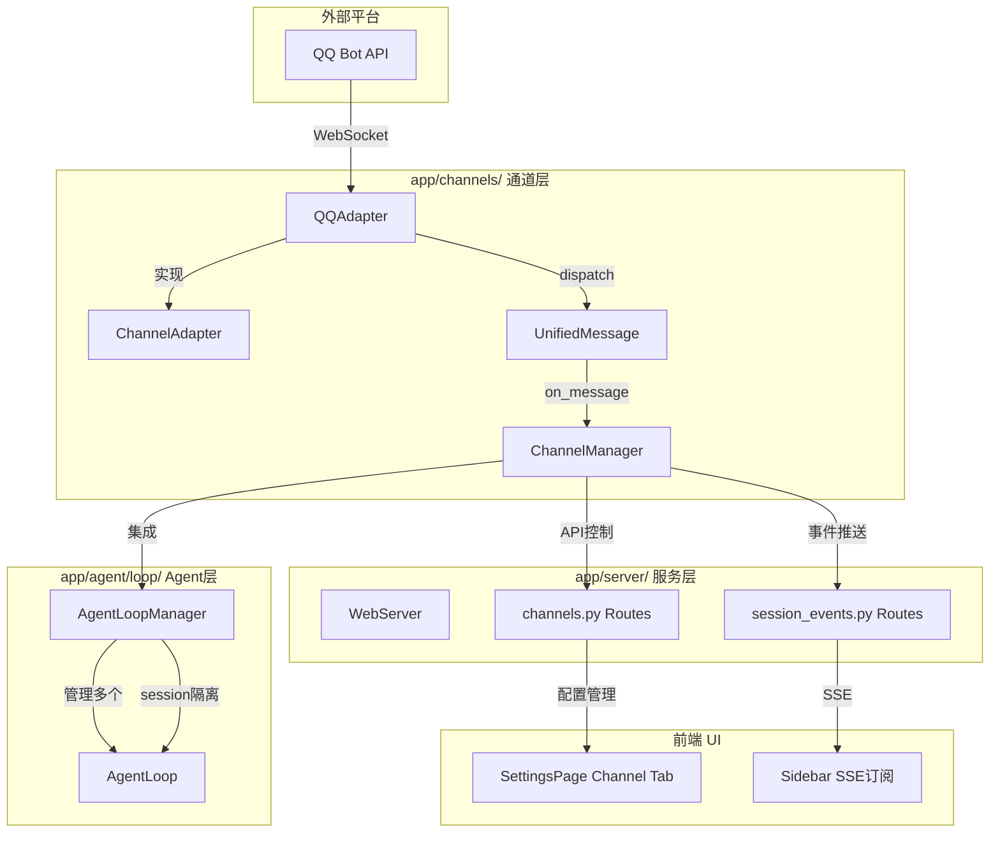
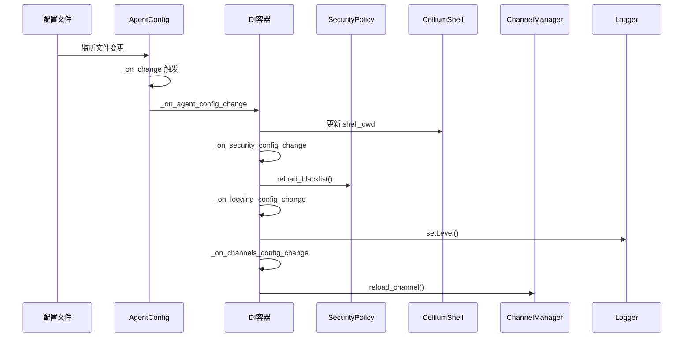
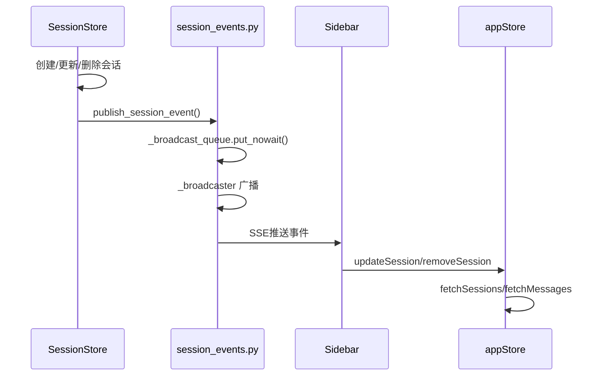

## 1. 高层摘要 (TL;DR)

**影响范围**：🔴 **高** - 新增多平台消息通道架构，集成QQ机器人支持，增强配置热更新和会话管理

**核心变更**：
- ✨ 新增 `app/channels/` 模块，实现统一的多平台消息抽象层
- 🤖 集成 QQ Bot WebSocket 适配器，支持私聊和群聊消息
- 🔥 增强配置热更新机制（security、logging、channels、shell_cwd）

---

## 2. 可视化概览

### 2.1 多平台通道架构图



### 2.2 配置热更新流程



### 2.3 SSE 事件推送机制



---

## 3. 详细变更分析

### 3.1 新增多平台通道架构

#### 📁 新增文件

| 文件路径 | 功能描述 |
|---------|---------|
| `app/channels/base.py` | 统一消息抽象层，定义 `UnifiedMessage` 和 `ChannelAdapter` 接口 |
| `app/channels/channel_manager.py` | 通道管理器，支持消息队列、背压控制、多适配器管理 |
| `app/channels/qq_adapter.py` | QQ Bot WebSocket 适配器，支持私聊/群聊/频道消息 |
| `app/channels/qq_channel_config.py` | QQ 通道配置管理，支持热重载 |
| `app/agent/loop/agent_loop_manager.py` | 多 Session 并发 AgentLoop 管理器 |

#### 🔑 核心类说明

**UnifiedMessage** - 统一消息格式
```python
@dataclass
class UnifiedMessage:
    platform: str           # 平台标识 (qq)
    user_id: str            # 用户ID
    content: str            # 消息内容
    message_type: str       # 消息类型 (c2c/group/guild)
    msg_id: str             # 消息ID
    group_id: Optional[str] # 群组ID
    channel_id: Optional[str] # 频道ID
    guild_id: Optional[str]  # 服务器ID
    
    @property
    def session_id(self) -> str:
        # 自动生成 session_id: qq:user_id 或 qq:group:group_id
```

**ChannelManager** - 通道协调器
- 支持多适配器注册和生命周期管理
- 内置消息队列和速率限制（每用户每分钟20条）
- 自动重连和错误处理
- 与 AgentLoopManager 深度集成

**QQAdapter** - QQ Bot 适配器
- 实现完整的 QQ Bot WebSocket 协议
- 支持 C2C 私聊、GROUP 群聊、GUILD 频道消息
- 自动心跳保活和会话恢复
- Session 状态持久化到 `~/.cache/cellium-agent/`

---

### 3.2 配置热更新增强

#### 📋 配置变更对比

| 配置项 | 旧行为 | 新行为 |
|-------|-------|-------|
| **shell_cwd** | ❌ 不支持 | ✅ 热更新 Shell 工作目录 |
| **security** | ❌ 需重启 | ✅ 热更新黑名单和禁用目录 |
| **logging** | ❌ 需重启 | ✅ 动态调整日志级别 |
| **channels** | ❌ 不支持 | ✅ 热更新通道配置 |

#### 🔧 代码变更 (Source: `app/agent/di_config.py`)

**新增 shell_cwd 热更新**:
```python
def _on_agent_config_change(section, old_val, new_val):
    shell_cwd = new_val.get("shell_cwd", "") if new_val else ""
    if shell_cwd and os.path.isdir(shell_cwd):
        shell = container.resolve(CelliumShell)
        if shell:
            shell._cwd = shell_cwd  # 动态更新工作目录
```

**新增 security 配置热更新**:
```python
def _on_security_config_change(section, old_val, new_val):
    if container.has(SecurityPolicy):
        security = container.resolve(SecurityPolicy)
        security.reload_blacklist()  # 重新加载黑名单
        forbidden_dirs = new_val.get("forbidden_dirs", [])
        security.set_forbidden_dirs(forbidden_dirs)
```

**新增 logging 配置热更新**:
```python
def _on_logging_config_change(section, old_val, new_val):
    level_str = new_val.get("level", "INFO").upper()
    new_level = level_map.get(level_str, logging.INFO)
    root_logger.setLevel(new_level)  # 动态调整日志级别
```

**新增 channels 配置热更新**:
```python
def _on_channels_config_change(section, old_val, new_val):
    qq_config = QQChannelConfig()
    qq_config.reload()
    adapter = channel_mgr.get_adapter("qq")
    if adapter:
        adapter.app_id = qq_config.get_app_id(force_reload=True)
        adapter.app_secret = qq_config.get_app_secret(force_reload=True)
```

---

### 3.3 会话管理增强

#### 📡 SSE 事件推送 (Source: `app/server/routes/session_events.py`)

新增 SSE 端点 `/api/session-events/events`，支持三种事件类型：

| 事件类型 | 触发时机 | 携带数据 |
|---------|---------|---------|
| `session_created` | 创建新会话 | 完整会话元数据 |
| `session_updated` | 更新消息数/活跃时间 | 更新后的会话数据 |
| `session_deleted` | 删除会话 | `{session_id}` |

#### 🔧 SessionStore 变更 (Source: `app/agent/loop/session_store.py`)

```python
def get_or_create_session(self, session_id: str = None):
    # QQ 会话自动生成标题
    if session_id.startswith("qq:"):
        title = f"QQ-{session_id.split(':')[1][:8]}"
    
    # 发布事件到 SSE
    self._publish_event("session_created", meta.to_dict())
```

#### 🛡️ 文件名安全处理 (Source: `app/agent/memory/session_notes.py`)

```python
def __init__(self, session_id: str, notes_dir: str = None):
    # 替换特殊字符，防止文件系统问题
    safe_id = session_id.replace(":", "_").replace("/", "_").replace("\\", "_")
    self.notes_path = os.path.join(self.notes_dir, f"{safe_id}.md")
```

---

### 3.4 Web 服务器与路由

#### 🚀 自动启动通道 (Source: `app/server/web_server.py`)

```python
@asynccontextmanager
async def lifespan_context(app: FastAPI):
    channel_mgr = ChannelManager.get_instance()
    if channel_mgr.get_adapter("qq") and not channel_mgr.is_running:
        await channel_mgr.start_all(with_queue=False)
        logger.info("[Channel] QQ 通道已在启动时自动连接")
    yield
```

#### 📡 新增 API 路由

| 端点 | 方法 | 功能 |
|-----|------|------|
| `/api/channels/reload` | POST | 热重载通道连接 |
| `/api/channels/status` | GET | 获取通道状态 |
| `/api/channels/start` | POST | 启动通道 |
| `/api/channels/stop` | POST | 停止通道 |
| `/api/session-events/events` | GET | SSE 事件流 |

---

### 3.5 前端 UI 改进

#### ⚙️ 新增通道配置页面 (Source: `ui/src/components/SettingsPage.tsx`)

新增 `ChannelSettings` 组件，支持配置：
- 启用/禁用通道
- 自动启动开关
- App ID / App Secret
- Intents 值
- 凭证状态指示器

```typescript
const handleSave = async () => {
  await putJSON(API.configUpdate('channels'), { value: payload, persist: true });
  await fetch(`${API.channelReload}?platform=qq`, { method: 'POST' }); // 自动热重载
};
```

#### 🔄 SSE 订阅机制 (Source: `ui/src/components/Sidebar.tsx`)

```typescript
useEffect(() => {
  const eventSource = new EventSource('/api/session-events/events');
  
  eventSource.onmessage = (event) => {
    const data = JSON.parse(event.data);
    if (data.type === 'session_created') {
      useAppStore.getState().fetchSessions();
    } else if (data.type === 'session_updated') {
      useAppStore.getState().updateSession(data.data);
    } else if (data.type === 'session_deleted') {
      useAppStore.getState().removeSession(data.data.session_id);
    }
  };
}, []);
```

#### 🎨 加载动画优化 (Source: `ui/src/index.css`)

新增三种加载动画样式：

| 样式名 | 效果 | 使用场景 |
|-------|------|---------|
| `.loading-dots` | 三色脉冲点 | 消息加载 |
| `.loading-glow` | 渐变光环 | 设置页面 |
| `.loading-pulse` | 呼吸脉冲 | 通用加载 |

---

### 3.6 配置文件变更

#### 📄 新增 `config/agent/channels.yaml`

```yaml
channels:
  qq:
    enabled: true
    auto_start: true
    app_id: '1903820314'
    app_secret: Zekqx4CKTdny9LXkxBPeuARi0IbuEYtE
    intents: 1107296256
```

#### 📄 更新 `config/agent/agent.yaml`

```yaml
agent:
  # ... 其他配置
  shell_cwd: "f:\\github\\Cellium-Agent\\workspace"  # 新增
```

#### 📄 更新 `config/settings.yaml`

```yaml
enabled_components:
  # ... 其他组件
  - components.qq_config.QQConfigCell  # 新增
```

---

### 3.7 依赖与测试

#### 📦 依赖更新 (Source: `requirements.txt`)

```txt
# QQ Bot WebSocket 客户端
websockets>=12.0
```

#### 🧪 新增测试脚本 (Source: `tests/channel_test.py`)

```python
async def test_channel_manager():
    manager = ChannelManager.get_instance()
    adapter = QQAdapter(app_id=app_id, app_secret=app_secret)
    manager.register_adapter(adapter)
    await manager.start_all()
```

---

## 4. 影响与风险评估

### ⚠️ 破坏性变更

| 变更项 | 影响范围 | 迁移建议 |
|-------|---------|---------|
| 新增 `channels.yaml` 配置文件 | 无影响 | 可选配置，默认从环境变量读取 |
| Session ID 文件名处理变更 | 现有会话笔记 | 自动兼容，特殊字符会被替换为下划线 |

### ✅ 测试建议

1. **QQ Bot 集成测试**
   - 验证私聊消息接收和回复
   - 验证群聊 @机器人 消息处理
   - 验证消息分片发送（>1000字符）

2. **配置热更新测试**
   - 修改 `shell_cwd` 并验证 Shell 工作目录变更
   - 修改 `logging.level` 并验证日志级别变更
   - 修改 `channels.qq` 配置并验证通道重连

3. **SSE 事件测试**
   - 创建新会话，验证前端实时刷新
   - 删除会话，验证前端实时移除
   - 多标签页同时订阅，验证事件广播

4. **并发场景测试**
   - 多用户同时发送消息，验证速率限制
   - 多会话并发执行，验证 session 隔离

### 🔒 安全注意事项

- ⚠️ `config/agent/channels.yaml` 包含敏感凭证，建议使用环境变量
- ⚠️ QQ Bot AppSecret 已在示例中暴露，生产环境需替换
- ✅ Session ID 文件名已做安全处理，防止路径遍历攻击

---

## 5. 总结

本次更新实现了完整的**多平台消息通道架构**，以 QQ Bot 为首个集成平台，具备以下核心能力：

1. **统一抽象层**：`ChannelAdapter` 接口便于扩展其他平台（微信、钉钉等）
2. **配置热更新**：支持 security、logging、channels、shell_cwd 动态更新
3. **实时同步**：SSE 事件推送实现前后端会话状态实时同步
4. **并发隔离**：AgentLoopManager 实现 per-session 锁和资源管理
5. **用户体验**：新增通道配置页面和优化的加载动画

系统架构更加模块化，为后续扩展更多第三方平台奠定了坚实基础。